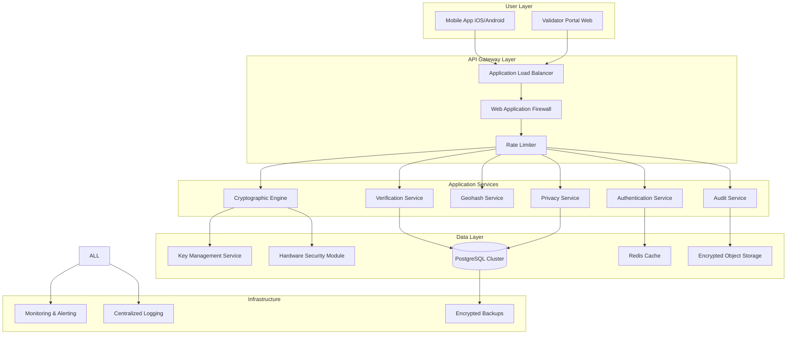
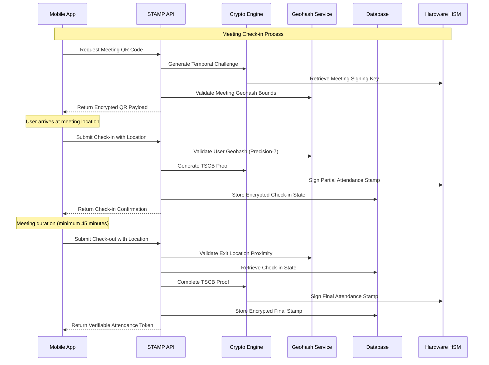
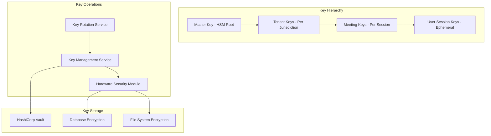

# STAMP System Architecture Overview

## Executive Summary

The Secure Tracking & Anonymous Meeting Protocol (STAMP) is a cryptographically secure, privacy-preserving system designed to replace traditional paper attendance cards for court-mandated recovery meetings. STAMP solves the fundamental conflict between compliance verification requirements and 4th Amendment privacy protections through innovative Temporal-Spatial Cryptographic Binding (TSCB) technology.

## Core Architecture Principles

### 1. Privacy by Design
- **Zero raw location storage**: Uses Precision-7 geohashes (~153m accuracy) instead of GPS coordinates
- **Pseudonymous identities**: SHA256-derived user identifiers with no personally identifiable information
- **Temporal data minimization**: Location data only collected during active check-in/check-out processes
- **Cryptographic verification**: Zero-knowledge proofs enable verification without data disclosure

### 2. Cryptographic Security
- **End-to-end encryption**: AES-256-GCM for all data at rest and in transit
- **Digital signatures**: Ed25519 for all attendance stamps and proofs
- **Hardware security**: HSM integration for private key operations
- **Constant-time implementations**: Prevents timing attack vulnerabilities

### 3. Constitutional Compliance
- **4th Amendment protection**: No continuous surveillance or location tracking
- **Due process safeguards**: Immutable audit trails with hash chain integrity
- **Data minimization**: Collection limited to court-mandated attendance verification
- **User consent**: Explicit consent with granular privacy controls

## High-Level System Components

## Core Data Flow: Check-in Process

## Temporal-Spatial Cryptographic Binding (TSCB)

TSCB is STAMP's core innovation that creates unforgeable proof of physical presence without continuous tracking:

### 1. Temporal Binding
- QR codes include time-locked challenges that rotate every 30 seconds
- Challenges cannot be pre-computed without access to meeting-specific keys
- Server validates timestamps within acceptable drift windows

### 2. Spatial Binding
- Check-in and check-out must occur within same Precision-7 geohash
- Maximum 200-meter distance between entry and exit coordinates
- Prevents "drive-by" attacks where users briefly enter meeting areas

### 3. Cryptographic Binding
- Temporal and spatial proofs are mathematically linked via hash functions
- Ed25519 signatures provide non-repudiation
- Device fingerprinting ensures session consistency

## Security Architecture

### Defense in Depth

1. **Network Security**
   - TLS 1.3 for all communications
   - WAF with DDoS protection
   - Network segmentation and VPCs

2. **Application Security**
   - Input validation and sanitization
   - SQL injection prevention
   - Cross-site scripting (XSS) protection
   - CSRF token validation

3. **Data Security**
   - Encryption at rest (AES-256-GCM)
   - Encryption in transit (TLS 1.3)
   - Database-level encryption
   - Key rotation every 90 days

4. **Access Control**
   - Multi-factor authentication
   - Role-based access control (RBAC)
   - Session timeout enforcement
   - Principle of least privilege

5. **Monitoring & Detection**
   - Real-time security monitoring
   - Anomaly detection algorithms
   - Automated incident response
   - Comprehensive audit logging

### Key Management Architecture

## Compliance Architecture

### HIPAA Compliance
- Administrative safeguards: Security officer, workforce training, access management
- Physical safeguards: Facility access controls, workstation security, media controls  
- Technical safeguards: Access control, audit controls, integrity, authentication, transmission security

### 4th Amendment Protection
- No continuous location tracking
- Purpose limitation to attendance verification only
- Data minimization with automatic expiration
- User consent with withdrawal options

### GDPR/CCPA Compliance
- Privacy by design implementation
- Data subject rights automation
- Breach notification procedures
- Cross-border data transfer controls

## Scalability Architecture

### Horizontal Scaling
- Stateless API services
- Database read replicas
- CDN for global distribution
- Auto-scaling based on demand

### Performance Targets
- Check-in latency: < 500ms (P99)
- Concurrent users: 10,000+
- Database transactions: 1,000 TPS
- Uptime: 99.99% SLA

### Disaster Recovery
- Multi-region deployment
- Automated failover
- Real-time data replication
- Recovery point objective: < 1 hour
- Recovery time objective: < 15 minutes

## Innovation Highlights

### 1. Temporal-Spatial Cryptographic Binding
First system to mathematically bind attendance proofs to both time and location, preventing pre-generation and replay attacks.

### 2. Privacy-Preserving Analytics
Differential privacy implementation enables aggregate reporting without individual data access.

### 3. Cross-Jurisdiction Verification
Blockchain-based trust network enables verification across multiple jurisdictions without data sharing.

### 4. AI-Powered Fraud Detection
Federated learning detects sophisticated gaming attempts while maintaining perfect privacy.

## Next Steps

This architecture provides the foundation for a production-ready STAMP deployment that balances security, privacy, compliance, and usability. The modular design enables phased implementation and continuous enhancement while maintaining backward compatibility.

For detailed implementation specifications, see:
- [API Documentation](../api/API_SPECIFICATION.md)
- [Database Schema](../database/SCHEMA_DESIGN.md)
- [Security Controls](../security/SECURITY_CONTROLS.md)
- [Compliance Framework](../compliance/COMPLIANCE_FRAMEWORK.md)